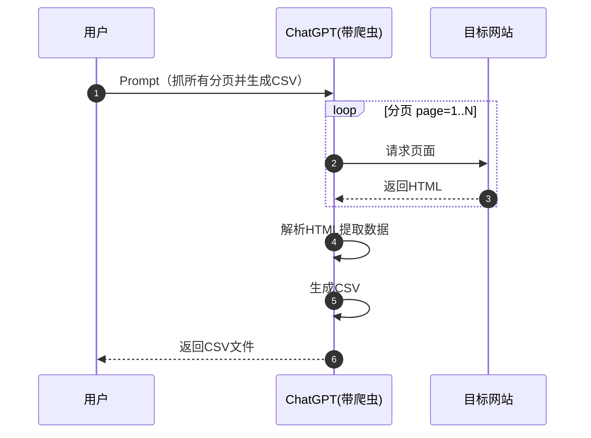
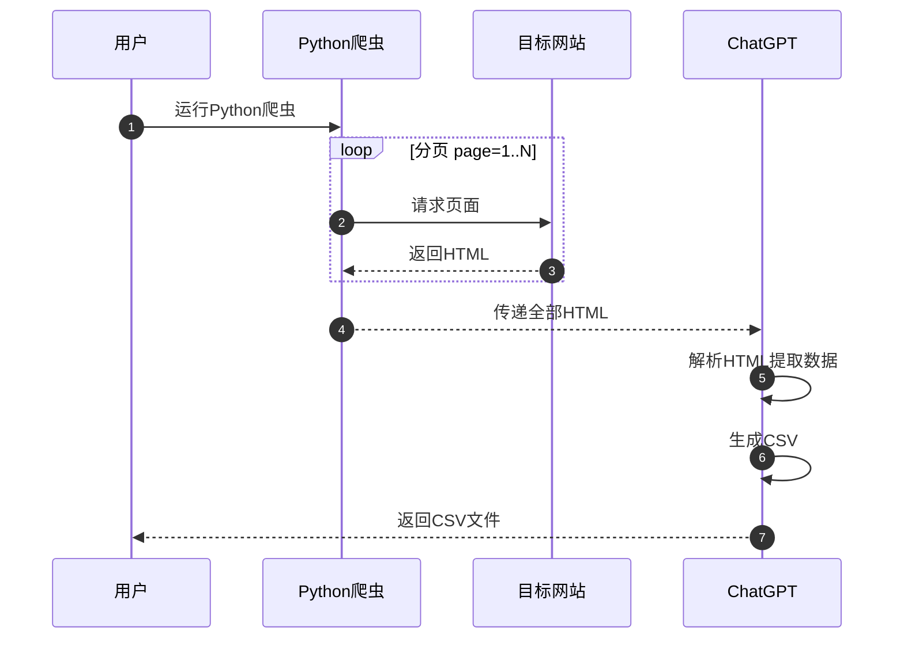
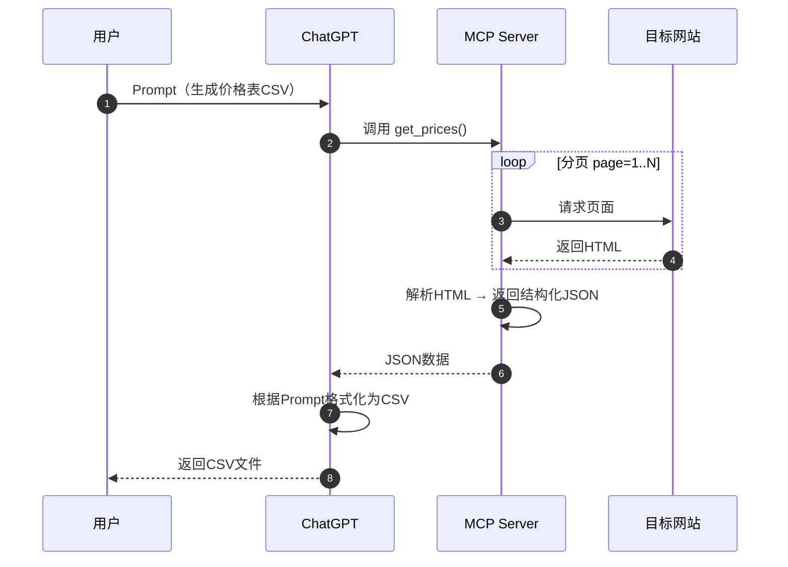
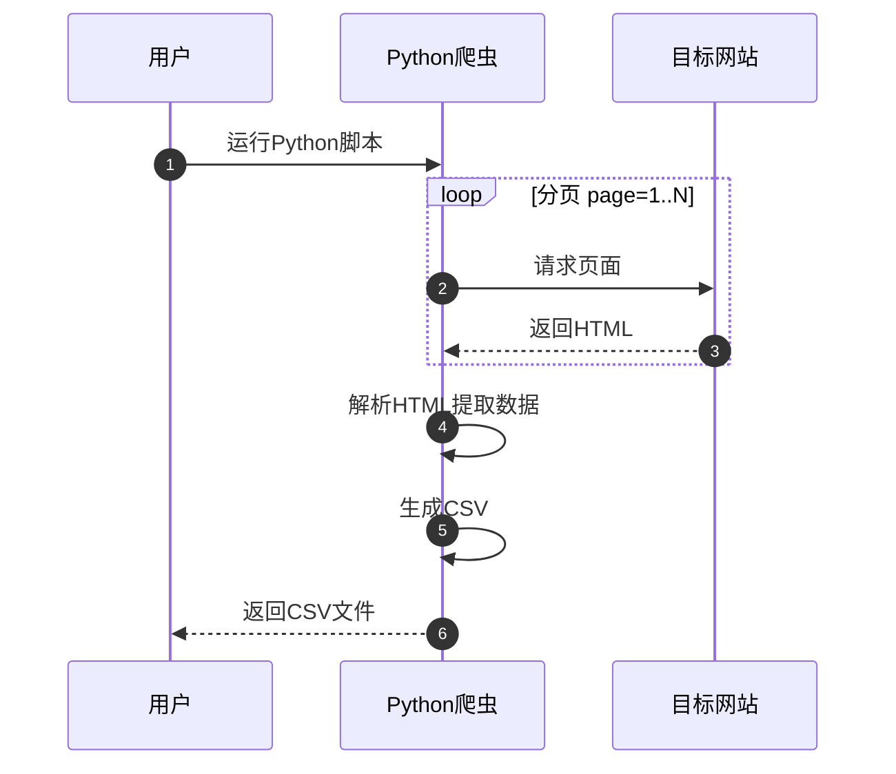

## ① 纯 Prompt 模式（AI 自带爬虫）

```mermaid
sequenceDiagram
    autonumber
    participant User as 用户
    participant AI as ChatGPT(带爬虫)
    participant Web as 目标网站

    User->>AI: Prompt（抓所有分页并生成CSV）
    loop 分页 page=1..N
        AI->>Web: 请求页面
        Web-->>AI: 返回HTML
    end
    AI->>AI: 解析HTML提取数据
    AI->>AI: 生成CSV
    AI-->>User: 返回CSV文件
```
## Python + AI 混合模式（Python爬 → AI解析）

```mermaid
sequenceDiagram
    autonumber
    participant User as 用户
    participant Py as Python爬虫
    participant Web as 目标网站
    participant AI as ChatGPT

    User->>Py: 运行Python爬虫
    loop 分页 page=1..N
        Py->>Web: 请求页面
        Web-->>Py: 返回HTML
    end
    Py-->>AI: 传递全部HTML
    AI->>AI: 解析HTML提取数据
    AI->>AI: 生成CSV
    AI-->>User: 返回CSV文件
```
## ③ MCP 模式（MCP爬 → AI输出）

```mermaid
sequenceDiagram
    autonumber
    participant User as 用户
    participant AI as ChatGPT
    participant MCP as MCP Server
    participant Web as 目标网站

    User->>AI: Prompt（生成价格表CSV）
    AI->>MCP: 调用 get_prices()
    loop 分页 page=1..N
        MCP->>Web: 请求页面
        Web-->>MCP: 返回HTML
    end
    MCP->>MCP: 解析HTML → 返回结构化JSON
    MCP-->>AI: JSON数据
    AI->>AI: 根据Prompt格式化为CSV
    AI-->>User: 返回CSV文件
```
## ④ 纯 Python 爬虫模式（全自己来）

```mermaid
sequenceDiagram
    autonumber
    participant User as 用户
    participant Py as Python爬虫
    participant Web as 目标网站

    User->>Py: 运行Python脚本
    loop 分页 page=1..N
        Py->>Web: 请求页面
        Web-->>Py: 返回HTML
    end
    Py->>Py: 解析HTML提取数据
    Py->>Py: 生成CSV
    Py-->>User: 返回CSV文件
```
